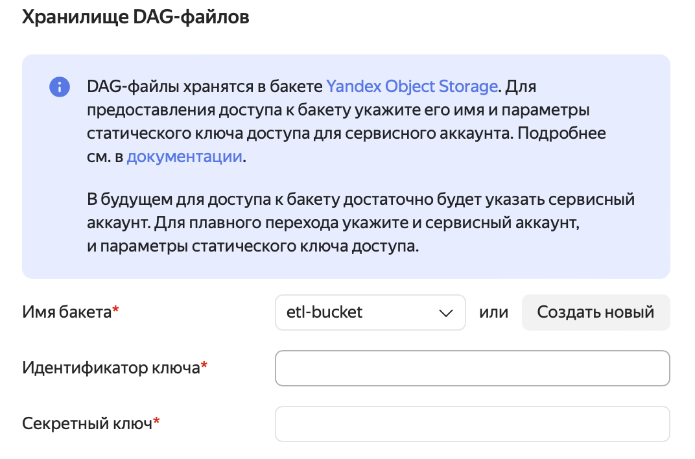
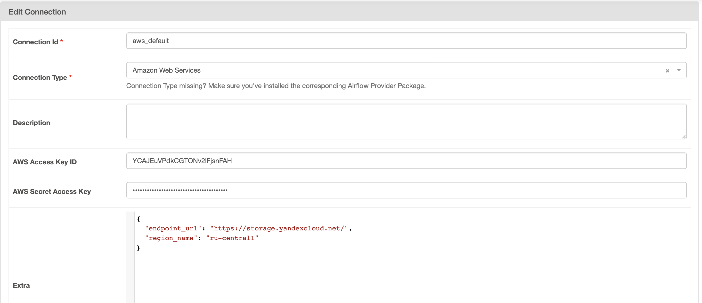
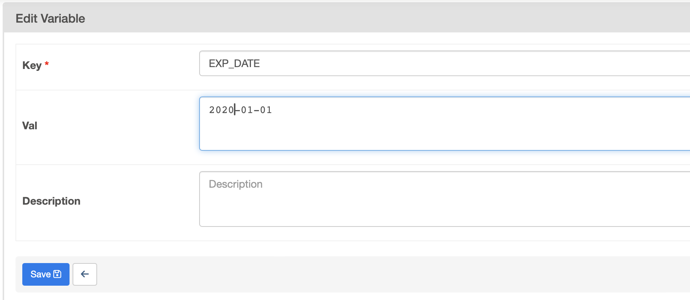
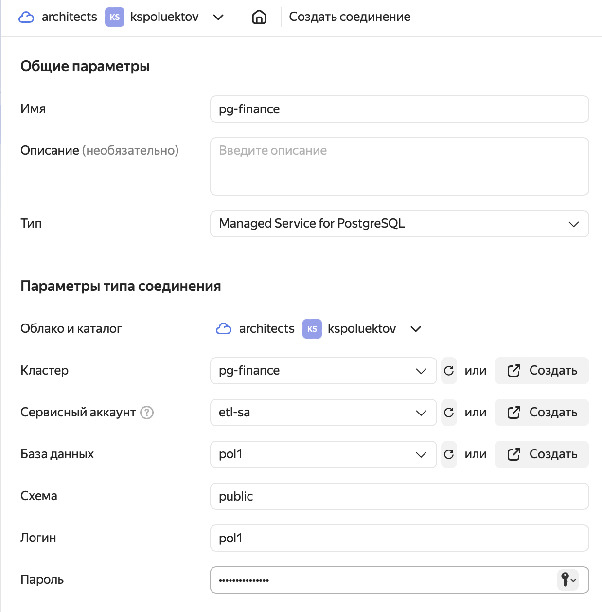
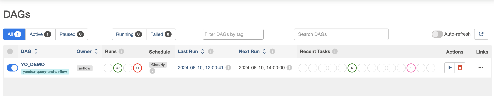
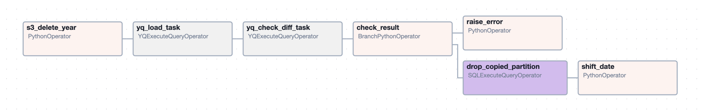

# Yandex query. Pipeline охлаждения данных с использованием федерации источников

В данном решении  будет представлен вариант решения задачи "охлаждения" данных с использованием Yandex Query и Managed Service for Apache Airflow

- будут созданы необходимые ресурсы
  - База данных Managed PostgreSQL c секционированной таблицей платежей
  - Object Storage для хранения "холодных" данных
- представлен пример Airflow DAG для
  - экспорта данных из PostgreSQL в Object Storage
  - верификации экспортированных данных с использованием федеративного SQL запроса


## Инфраструктура

Инфраструктура создается с помощью Terraform configuration.  Для этого 

- получить IAM токен 

```sh 
export TF_VAR_yc_token=$(yc iam create-token)
```

- Применить Terraform Configuration
```sh
cd src/tf
terraform init
terraform apply
```

Примечание: по возможности исполняйте предыдущую команду в окружении с установленным пакетом postgresql-client и установленным по [инструкции](https://yandex.cloud/ru/docs/managed-postgresql/operations/connect#get-ssl-cert) сертификатом. При выполнении этих условий все необходимые действия с Managed PostgreSQL выполняться автоматически. В противном случае после создания базы и пользователя Вам будет необходимо выполнить [SQL сценарий](src/sql/db_init.sql) над созданной базой вручную.

В результате выполнения Terraform будут созданы
 - сеть и подсеть.
 - Managed PostgreSQL с базой и секционированной таблицей "платежей" и данными за четыре года - 2020-2024. Подробнее см. [db_init.sql](src/sql/db_init.sql)
 - два Object Storage bucket-а: один для Airflow DAGs, другой для данных, которые мы будем сохранять.
 - сервисный аккаунт со статическим и авторизованным ключами доступа.

После создания ресурсов нужно дополнительно дать доступ к Managed PostgreSQL из Yandex Query (на момент написания этого решения данный атрибут не поддержан в Terraform provider).
 

## Managed Service for Apache Airflow
На текущий момент нет возможности автоматизировать создание и настройку Managed Service for Apache Airflow. Поэтому ниже идет последовательность, которую необходимо выполнить для создания сервиса через консоль.

Создать Managed Service for Apache Airflow со следующими настройками 



Здесь для заполнения полей использовать значения полученные при выполнении команд

Идентификатор ключа - 
```sh
terraform output access_key
```
Секретный ключ 
```sh
terraform output secret_key
```
Остальные настройки заполнить на свое усмотрение, либо оставить значения по умолчанию.


После того, как сервис будет создан, зайти в консоль администрирования Apache Airflow 
- создать три новых соединения

  - Admin-> Connections-> Add new record
    c параметрами

    Connection Id = yc-airflow-sa

    Connection Type = Yandex Cloud
    
    Service account auth JSON = содержимое файла src/tf/auth_key.json
    
    Public SSH key = содержимое поля private_key файла src/tf/auth_key.json

  ,

  - Admin-> Connections-> Add new record 
    <details><summary>c параметрами</summary>
    
     
    </details>

    Connection Id = aws_default

    Connection Type = Amazon Web Services

    AWS Access Key ID = Access key полученный выше при создании статического ключа доступа

    AWS Secret Access Key = Secret key полученный выше при создании статического ключа доступа

    Extra = 
    ```json
    {
    "endpoint_url": "https://storage.yandexcloud.net/",
    "region_name": "ru-central1"
    }```

  и

  - Admin-> Connections-> Add new record 
  
    <details><summary>c параметрами</summary>

       
    </details>

    Connection Id = pg

    Connection Type = Postgres
    
    Host = FQDN хоста PosgreSQL, созданного из Terraform Configuration

    Database = Login = имя пользователя из Terraform Configuration
    
    Password =  пароль пользователя из Terraform Configuration

    Port = 6432


 - и две новых переменных

    - Admin-> Variables-> Add new record
      
      <details><summary>c параметрами</summary>

        
      </details>

      Key = YC_DP_FOLDER_ID
      
      Val = <FOLDER_ID>
      где FOLDER_ID это идентификатор каталога в Yandex Cloud 

    и
    - Admin-> Variables-> Add new record
      
      <details><summary>c параметрами</summary>

         </details>
      </details>

      Key = EXP_DATE
      
      Val = 2020-01-01 - дата для первого экспорта данных


## Yandex Query

Создадим два подключения
 - подключение к Object Storage, где будут лежать "холодные" данные
 

 - подключение к Managed PostgreSQL, откуда данные будем забирать  
 
 здесь в качестве пользователя и пароля нужно указать данные, которые использовались в Terraform Configuration

и одну привязку


## Apache Airflow. Запуск DAG
И теперь можно пробовать запустить наш DAG. Он должен присутствовать в списке DAG-ов под именем YQ_DEMO.



Коротко о сути графа обработки:



- на первом этапе должно произойти удаление всех объектов Object Storage bucket с префиксами payment_year=<год из переменной EXP_DATE>. Это делается на случай повторного экспорта
```python
    object_keys = s3_hook.list_keys(bucket_name=bucket_name, prefix='etl/payment_year={var}'.format(var = exp_start_date.year))
    s3_hook.delete_objects(bucket=bucket_name, keys=object_keys)
```

- на втором этапе - загрузка данных из PostgreSQL в Object Storage с использованием Yandex Query.
```python
    yq_load_task = YQExecuteQueryOperator(
        task_id = 'yq_load_task',
        folder_id = Variable.get('YC_DP_FOLDER_ID'),
        yandex_conn_id = ycSA_connection.conn_id,
        sql = '''
            $s = (select unwrap(p.id) as id, p.doc_num, p.accdt, p.acckt, p.amount, cast(p.payment_date as datetime) as payment_date, descr, p.state 
                from `pg-finance`.payments p 
                where cast(p.payment_date as datetime) >= date('{var1}') and  
                        cast(p.payment_date as datetime) < date('{var2}')
            );
            insert into etl_object_storage 
            (id, doc_num, accdt, acckt, amount, payment_date, descr, state, payment_year) 
            select id, doc_num, accdt, acckt, amount, payment_date, descr, state, unwrap(cast(DateTime::GetYear(payment_date) as UInt32)) from $s;
        '''.format(var1 = exp_start_date.strftime('%Y-%m-%d'), var2 = exp_end_date.strftime('%Y-%m-%d')),
        dag = yq_demo_dag
    )
```

- третий этап: сверка данных. Для сверки мы тоже используем федеративный запрос Yandex Query, сравнивая данные в разных источниках
```python
    yq_check_diff_task = YQExecuteQueryOperator(
        task_id = 'yq_check_diff_task',
        folder_id = Variable.get('YC_DP_FOLDER_ID'),
        yandex_conn_id = ycSA_connection.conn_id,
        sql = '''
            $s = (select unwrap(p.id) as id, p.doc_num, p.accdt, p.acckt, p.amount, cast(p.payment_date as datetime) as payment_date, descr, p.state 
                from `pg-finance`.payments p 
                where cast(p.payment_date as datetime) >= date('{var1}') and  
                        cast(p.payment_date as datetime) < date('{var2}')
            );
            $d = (select p.id as id, p.doc_num, p.accdt, p.acckt, p.amount, p.payment_date, descr, p.state 
                from etl_object_storage p 
                where p.payment_date >= date('{var1}') and  
                        p.payment_date < date('{var2}')
            );
            select count(1) from $s s exclusion join $d d on s.id = d.id and s.doc_num = d.doc_num
              and s.accdt = d.accdt and s.acckt = d.acckt and s.amount = d.amount and s.state = d.state;
        '''.format(var1 = exp_start_date.strftime('%Y-%m-%d'), var2 = exp_end_date.strftime('%Y-%m-%d')),
        dag = yq_demo_dag
    )
```

- дальше проще - проверяем результат сверки (нулевое количество строк соединения exclusion join), удаляем перенесенные разделы и меняем переменную EXP_DATE для следующего экспорта. Подробнее см. код [src/py/yq_dag.py](src/py/yq_dag.py)

Если все создано и настроено верно, то в результате успешного запуска DAG должен выглядеть примерно так


## Что в итоге
- С помощью Yandex Query и Managed Service for Apache Airflow мы построили pipeline автоматизации частичного переноса данных из реляционной базы в Object Storage. 
- При этом качество переноса верифицируется федеративным YQL запросом. 
- Федерация источников позволяет и далее работать с разделенными данными из Yandex Query


<details><summary>Текст запроса</summary>

```sql
$a = 
select id, cast(payment_date as datetime) as pdate, 'pg' as src from `pg-finance`.payments 
union all 
select id, payment_date as pdate, 's3' as src from etl_object_storage;

select dyear, src, count(1) from $a 
group by DateTime::GetYear(pdate) as dyear, src order by dyear;
```
</details>

