# Yandex Query: Pipeline for cooling data using a federation of sources

Here, we will provide an example of cooling data using Yandex Query and Managed Service for Apache Airflow:

- First, we will create the required resources:
  - Managed PostgreSQL database with a sectioned table for payment data.
  - Object Storage to store cold data.
- Then, we will give an example of Airflow DAG for:
  - Exporting data from PostgreSQL to Object Storage.
  - Verifying the exported data through a federated SQL query.


## Infrastructure

Create the infrastructure using Terraform Configuration.  To do this: 

- Get an IAM token: 

```sh 
export TF_VAR_yc_token=$(yc iam create-token)
```

- Apply Terraform Configuration:
```sh
cd src/tf
terraform init
terraform apply
```

Note: If possible, run the above command in an environment with the `postgresql-client` package installed and the certificate installed as per [this guide](https://yandex.cloud/docs/managed-postgresql/operations/connect#get-ssl-cert); this will automate all required actions with Managed PostgreSQL. Otherwise, after creating the DB and user, you will need to manually run the [SQL script](src/sql/db_init.sql) over the created DB.

Once you run Terraform, it will create:
 - Network with a subnet.
 - Managed PostgreSQL instance with a DB and sectioned table of payments, providing data for four years (2020 to 2024). For more information, see [db_init.sql](src/sql/db_init.sql).
 - Two Object Storage buckets: one for Airflow DAGs and another one for the data to save.
 - Service account with a static access key and an authorized one.

After creating these resources, you should additionally give access to Managed PostgreSQL from Yandex Query (at the time of this writing, Terraform provider does not support this attribute).
 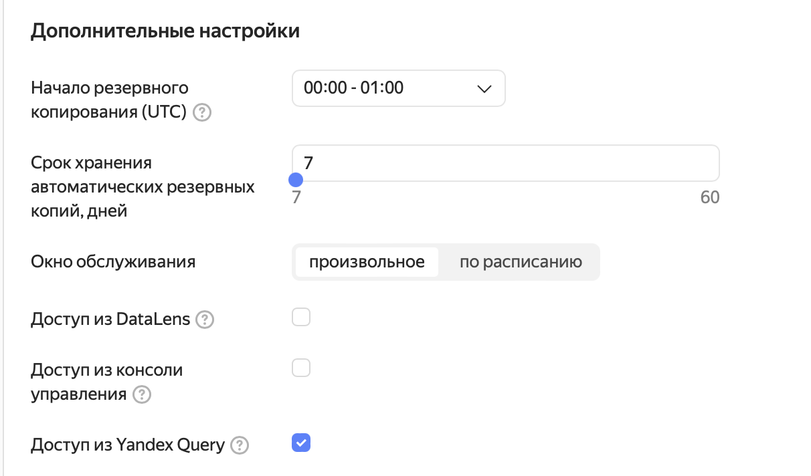

## Managed Service for Apache Airflow
Currently, there is no way to automate the creation and configuration of Managed Service for Apache Airflow. This is why, below, you can find the steps to follow to create the service through the console.

Create a Managed Service for Apache Airflow instance configured as follows: 

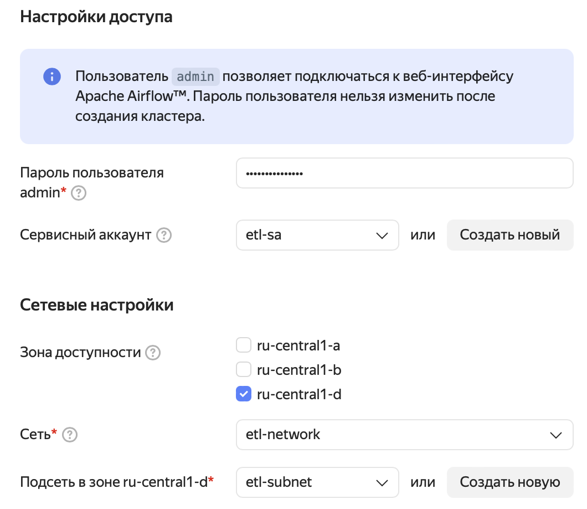

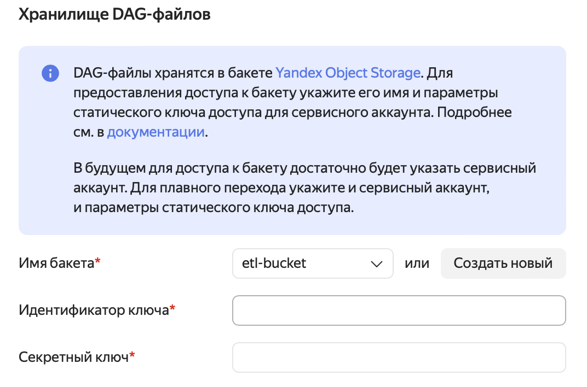
To fill in the fields, use the values you got when running the following commands:

Key ID: 
```sh
terraform output access_key
```
Secret key: 
```sh
terraform output secret_key
```
Configure other settings as you want, or leave the default values.


After the service is created, log in to the Apache Airflow administration console. 
- Create three new connections:

  - Admin-> Connections-> Add new record
    with the following parameters:

    Connection Id = yc-airflow-sa

    Connection Type = Yandex Cloud
    
    Service account auth JSON = contents of src/tf/auth_key.json
    
    Public SSH key = contents of the `private_key` field in src/tf/auth_key.json

  ,

  - Admin-> Connections-> Add new record 
    <details><summary>with parameters</summary>
    
    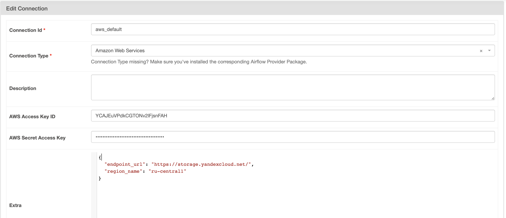 
    </details>

    Connection Id = aws_default

    Connection Type = Amazon Web Services

    AWS Access Key ID = Access key you got earlier when creating the static access key

    AWS Secret Access Key = Secret key you got earlier when creating the static access key

    Extra = 
    ```json
    {
    "endpoint_url": "https://storage.yandexcloud.net/",
    "region_name": "ru-central1"
    }```

  and

  - Admin-> Connections-> Add new record 
  
    <details><summary>with parameters</summary>

      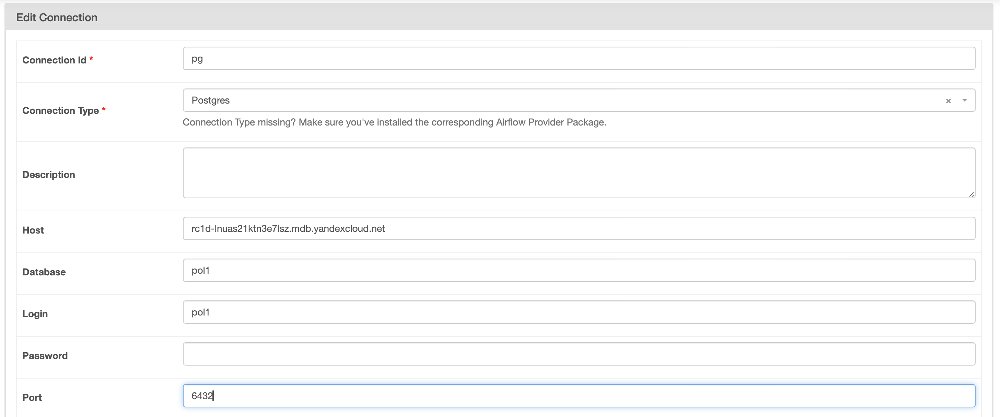 
    </details>

    Connection Id = pg

    Connection Type = Postgres
    
    Host = FQDN of your PostgreSQL host created from Terraform Configuration

    Database = Login = your user name from Terraform Configuration
    
    Password = your user password from Terraform Configuration

    Port = 6432


 - and two new variables:

    - Admin-> Variables-> Add new record
      
      <details><summary>with parameters</summary>

        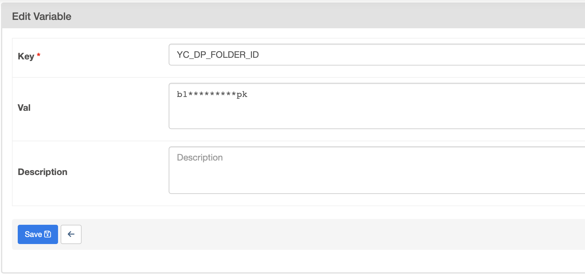
      </details>

      Key = YC_DP_FOLDER_ID
      
      Val = <FOLDER_ID>
      where FOLDER_ID is the ID of your folder in Yandex Cloud 

    and
    - Admin-> Variables-> Add new record
      
      <details><summary>with parameters</summary>

        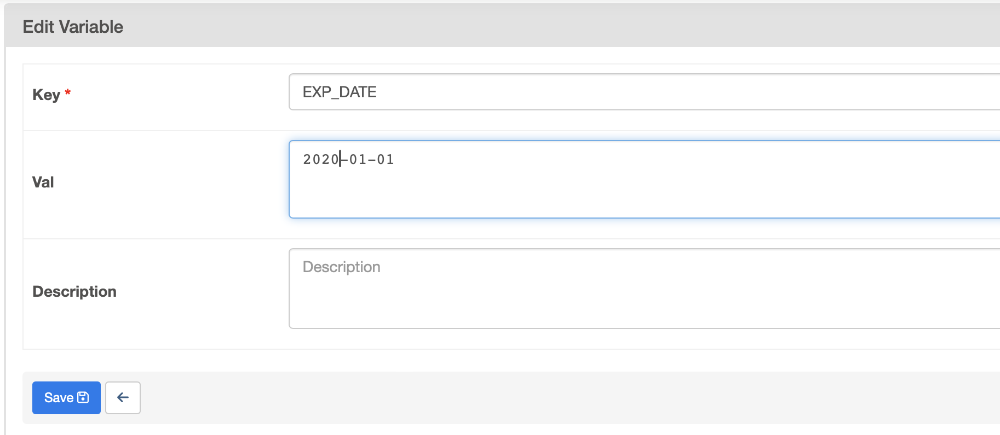 </details>
      </details>

      Key = EXP_DATE
      
      Val = 2020-01-01 (date for the first data export)


## Yandex Query

Let’s create two connections as follows:
 - Connection to Object Storage to store our cold data.
 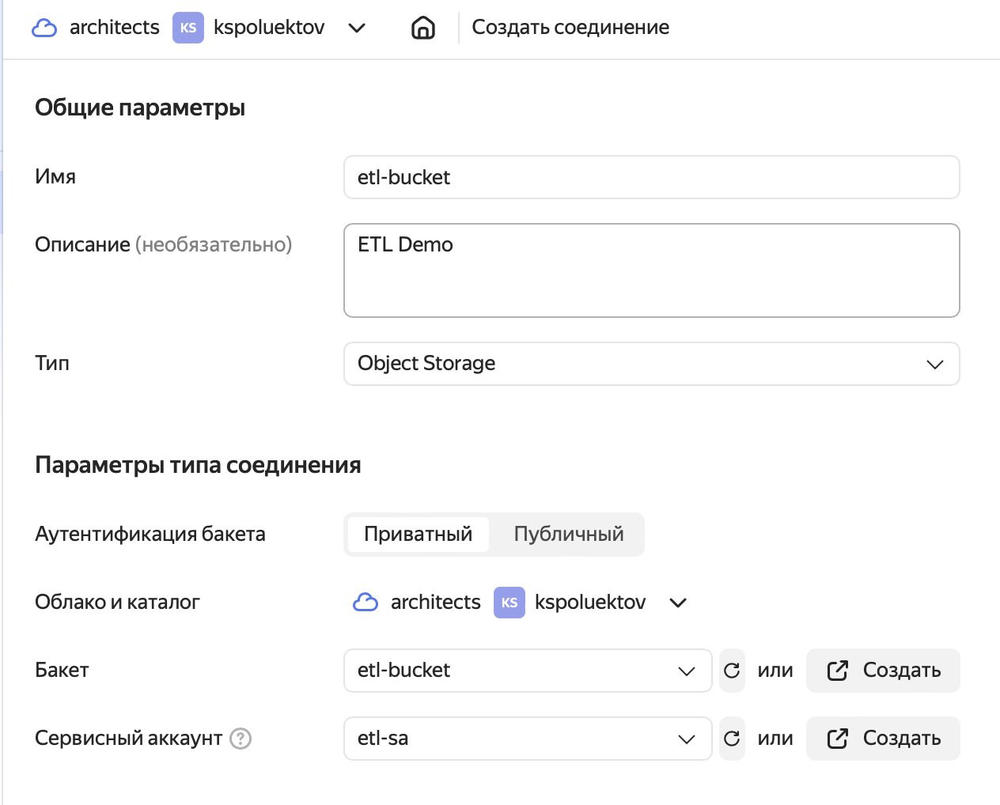

 - Connection to Managed PostgreSQL from where we take our data.  
 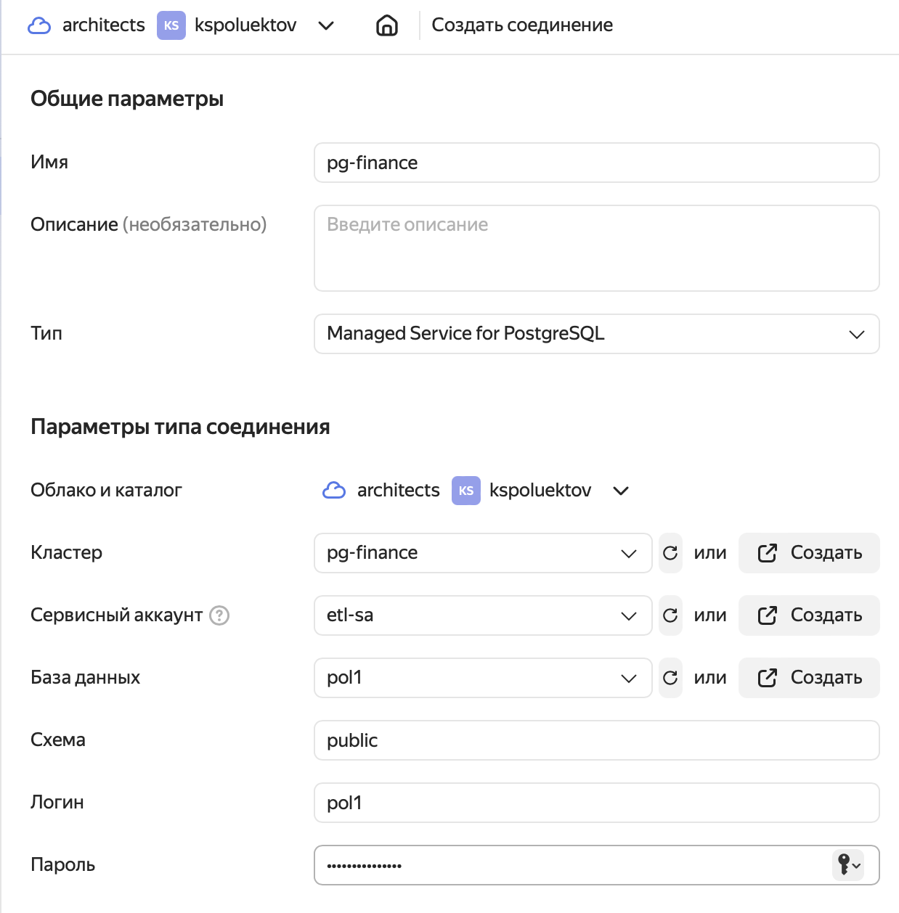
 Use the same username and password as in Terraform Configuration earlier.

Also, let's create a binding:
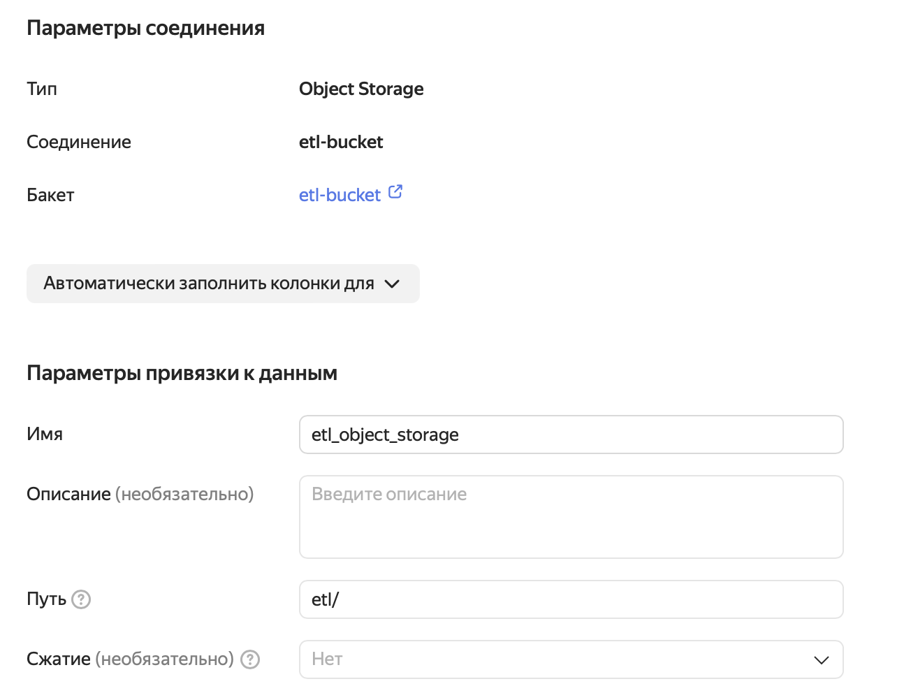
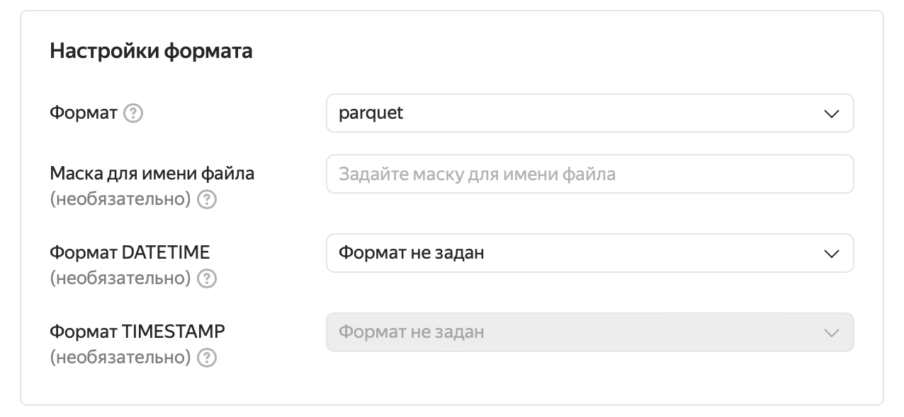
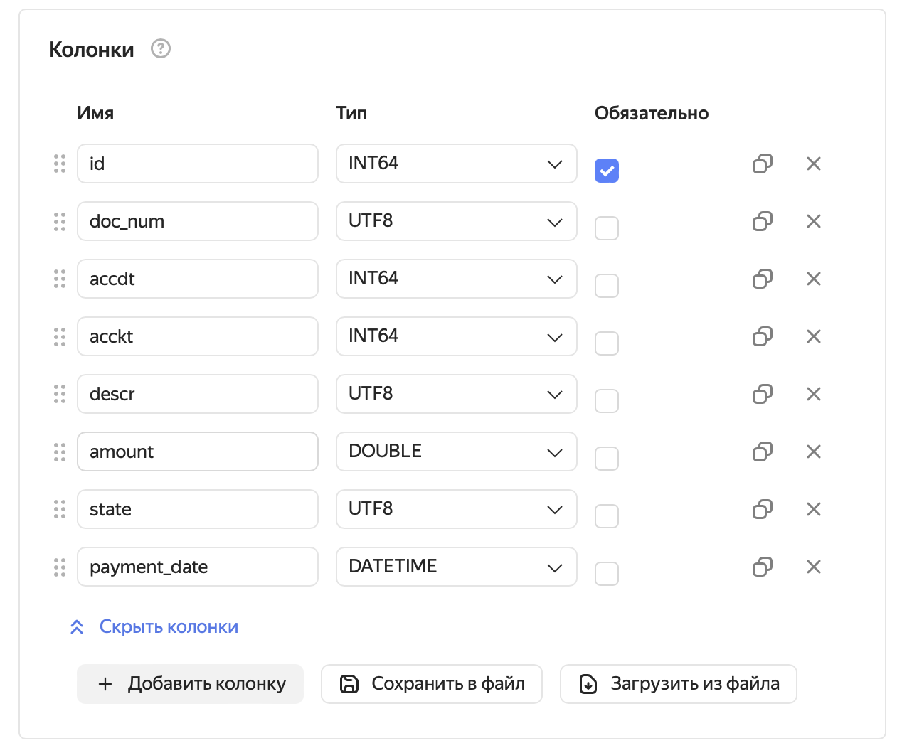
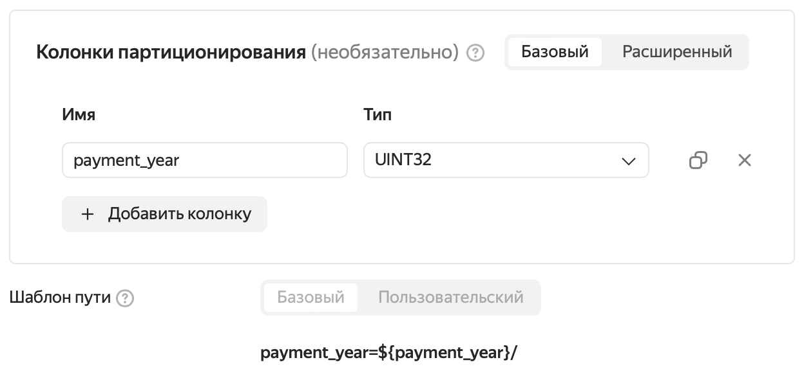

## Apache Airflow: Starting DAG
Now, we can try to start our DAG. It should appear in the DAG list as YQ_DEMO.
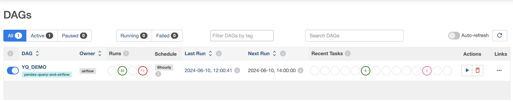


In a nutshell, the processing graph is as follows:

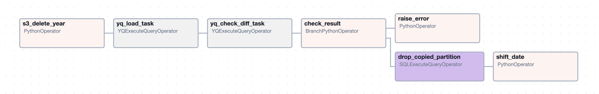

- Step 1: Deleting all Object Storage bucket objects prefixed with `payment_year=<year from EXP_DATE>`. This is done in case of re-exporting.
```python
    object_keys = s3_hook.list_keys(bucket_name=bucket_name, prefix='etl/payment_year={var}'.format(var = exp_start_date.year))
    s3_hook.delete_objects(bucket=bucket_name, keys=object_keys)
```

- Step 2: Loading data from PostgreSQL to Object Storage with Yandex Query:
```python
    yq_load_task = YQExecuteQueryOperator(
        task_id = 'yq_load_task',
        folder_id = Variable.get('YC_DP_FOLDER_ID'),
        yandex_conn_id = ycSA_connection.conn_id,
        sql = '''
            $s = (select unwrap(p.id) as id, p.doc_num, p.accdt, p.acckt, p.amount, cast(p.payment_date as datetime) as payment_date, descr, p.state 
                from `pg-finance`.payments p 
                where cast(p.payment_date as datetime) >= date('{var1}') and  
                        cast(p.payment_date as datetime) < date('{var2}')
            );
            insert into etl_object_storage 
            (id, doc_num, accdt, acckt, amount, payment_date, descr, state, payment_year) 
            select id, doc_num, accdt, acckt, amount, payment_date, descr, state, unwrap(cast(DateTime::GetYear(payment_date) as UInt32)) from $s;
        '''.format(var1 = exp_start_date.strftime('%Y-%m-%d'), var2 = exp_end_date.strftime('%Y-%m-%d')),
        dag = yq_demo_dag
    )
```

- Step 3: Data reconciliation. For this, we use Yandex Query again, comparing data in different sources via a federated query:
```python
    yq_check_diff_task = YQExecuteQueryOperator(
        task_id = 'yq_check_diff_task',
        folder_id = Variable.get('YC_DP_FOLDER_ID'),
        yandex_conn_id = ycSA_connection.conn_id,
        sql = '''
            $s = (select unwrap(p.id) as id, p.doc_num, p.accdt, p.acckt, p.amount, cast(p.payment_date as datetime) as payment_date, descr, p.state 
                from `pg-finance`.payments p 
                where cast(p.payment_date as datetime) >= date('{var1}') and  
                        cast(p.payment_date as datetime) < date('{var2}')
            );
            $d = (select p.id as id, p.doc_num, p.accdt, p.acckt, p.amount, p.payment_date, descr, p.state 
                from etl_object_storage p 
                where p.payment_date >= date('{var1}') and  
                        p.payment_date < date('{var2}')
            );
            select count(1) from $s s exclusion join $d d on s.id = d.id and s.doc_num = d.doc_num
              and s.accdt = d.accdt and s.acckt = d.acckt and s.amount = d.amount and s.state = d.state;
        '''.format(var1 = exp_start_date.strftime('%Y-%m-%d'), var2 = exp_end_date.strftime('%Y-%m-%d')),
        dag = yq_demo_dag
    )
```

- The further process is easier: we check the reconciliation result (`exclusion join` should return zero lines), delete the transferred partitions, and edit the `EXP_DATE` variable for the next export. For more information, see the code in [src/py/yq_dag.py](src/py/yq_dag.py).

If everything is created and configured correctly, a successful DAG launch should look like this:
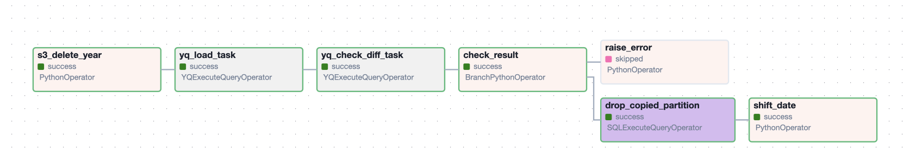

## What we got
- Using Yandex Query and Managed Service for Apache Airflow, we built a pipeline to automate the partial migration of data from a relational database to Object Storage. 
- To verify the migration quality, we use a federated YQL query. 
- With a federation of sources, you can keep performing operations with split data from Yandex Query.


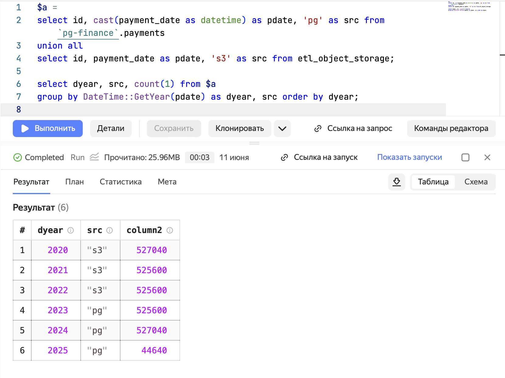

<details><summary>Query text</summary>

```sql
$a = 
select id, cast(payment_date as datetime) as pdate, 'pg' as src from `pg-finance`.payments 
union all 
select id, payment_date as pdate, 's3' as src from etl_object_storage;

select dyear, src, count(1) from $a 
group by DateTime::GetYear(pdate) as dyear, src order by dyear;
```
</details>

